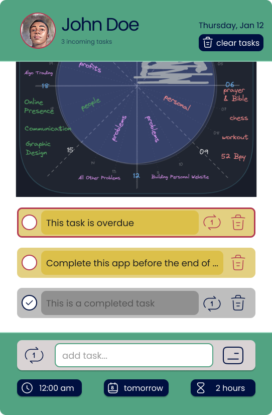
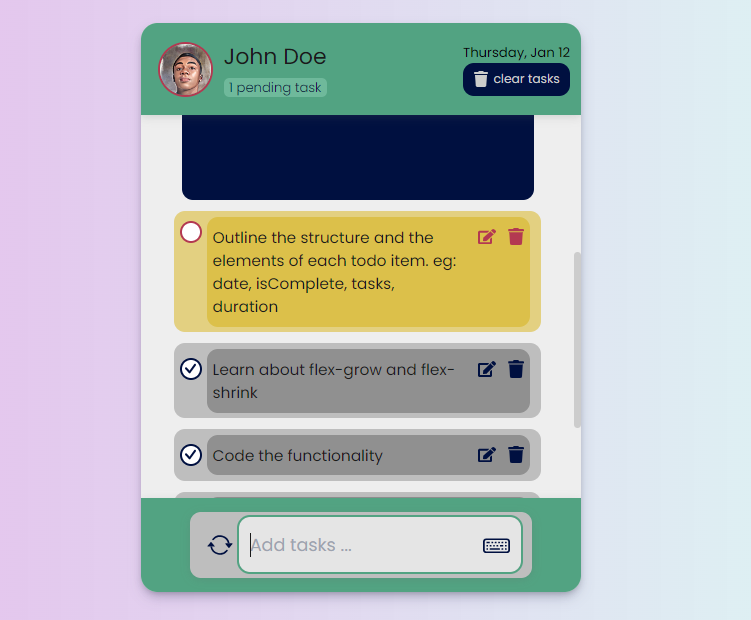

# A Short Poem -> `src: chatGPT`

A quest was embarked by developers bold
To create a to-do app, sleek and old
With React, they crafted each feature well
Each component, a story to tell

Marking tasks complete, a breeze to do
Deleting them, just a click or two
React hooks, added power untold
State management, now so bold

Beta testing, the app emerged victorious
Released to the public, it became auspicious
A tool for organization and productivity
Its legend, spreading far and wide, with velocity

The developers continued to improve and update
Making the app, even more great
A true masterpiece of technology
A to-do app, for all to see.

# Project Snapshot

## Design Snapshot

## Development Snapshot

---

🏃‍♂️ 🔭 🧨 💪 🏆 🙌

---

> This app is available online at [react-calculator](https://xmon-todo.vercel.app)

You can also checkout similar projects:

- [django-todo-app](https://github.com/esmond-adjei/django-todo-app)
